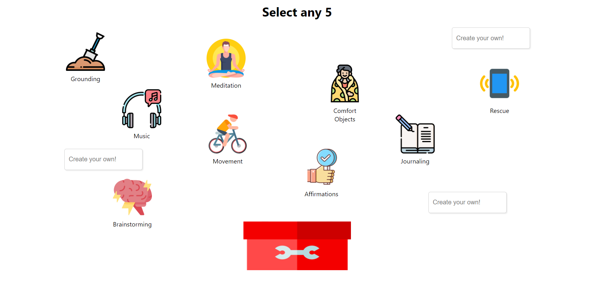
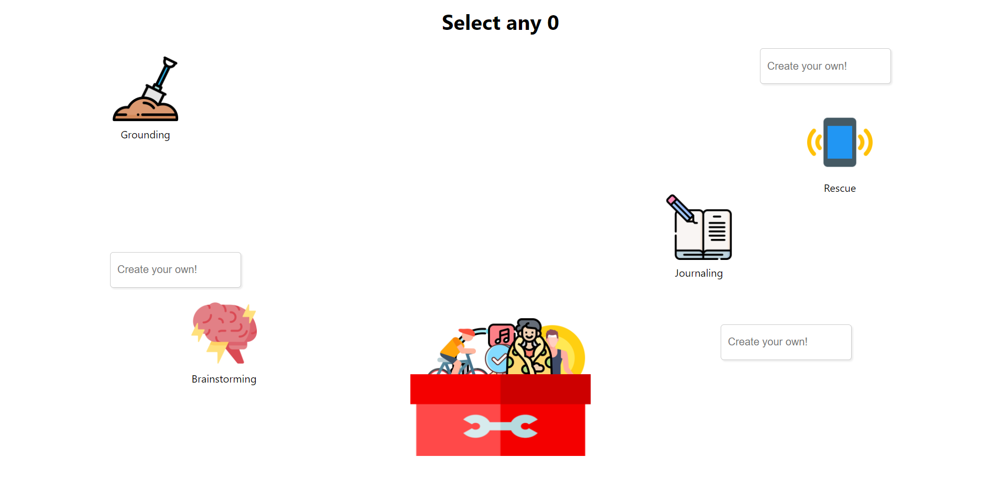

# Emotional Toolkit React Component

This Component was designed for an ongoing project which lets user to select any 5 emotional activities they prefer to do.

## A few Screen Shots...

### Default

    

### Selected

    

## To run this app

### 'cd your-app-root-directory'

Navigate to the root folder where you copy the code.

### Run 'npm install'

Install all the dependencies in a folder named 'node_modules'.

### Run 'npm start'

Runs the app in the development mode.\
Open [http://localhost:3000](http://localhost:3000) to view it in the browser.
